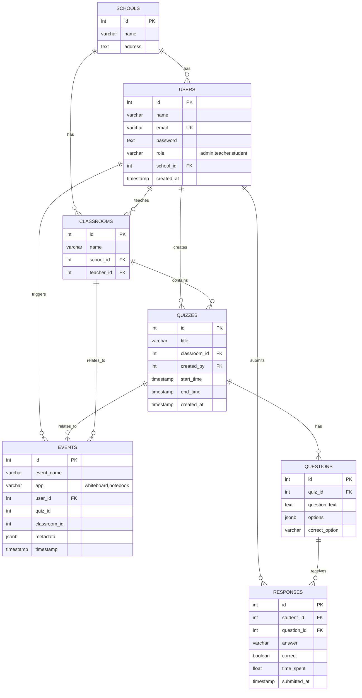

# Entity-Relationship Diagram

## EduAnalytics Database Schema



## Table Descriptions

### SCHOOLS
**Purpose:** Stores school/institution information  
**Records:** ~1,000 (static)  
**Key Relationships:**
- Has many users (students, teachers, admins)
- Has many classrooms

### USERS
**Purpose:** Stores all user accounts (students, teachers, admins)  
**Records:** ~900,000 students + 30,000 teachers = 930,000  
**Key Relationships:**
- Belongs to one school
- Teachers have many classrooms
- Teachers create many quizzes
- Students submit many responses
- All users trigger events

**Roles:**
- `admin` - School administrators
- `teacher` - Classroom teachers  
- `student` - Students

### CLASSROOMS
**Purpose:** Represents physical/virtual classrooms  
**Records:** ~30,000 (30 per school × 1,000 schools)  
**Key Relationships:**
- Belongs to one school
- Has one teacher (owner)
- Contains many quizzes
- Related to many events

### QUIZZES
**Purpose:** Quiz sessions created by teachers  
**Records:** ~1.5M per year (30K classrooms × 50 quizzes/year)  
**Key Relationships:**
- Belongs to one classroom
- Created by one teacher
- Has many questions
- Related to many events

**Temporal Fields:**
- `start_time` - Scheduled start
- `end_time` - Scheduled end
- `created_at` - When quiz was created

### QUESTIONS
**Purpose:** Individual questions within a quiz  
**Records:** ~15M per year (1.5M quizzes × 10 questions avg)  
**Key Relationships:**
- Belongs to one quiz
- Receives many student responses

**Special Fields:**
- `options` (JSONB) - MCQ options, e.g., `{"A": "Option 1", "B": "Option 2", ...}`
- `correct_option` - The correct answer key (e.g., "B")

### RESPONSES
**Purpose:** Student answers to questions  
**Records:** ~450M per year (900K students × 500 questions/year)  
**Key Relationships:**
- Submitted by one student
- For one question

**Analytics Fields:**
- `correct` - Boolean flag for correctness
- `time_spent` - Seconds spent on question (for engagement metrics)
- `submitted_at` - Timestamp for temporal analysis

### EVENTS
**Purpose:** Tracks all user interactions for analytics  
**Records:** ~3.3B per year (10 events/student/day × 900K × 365)  
**Key Relationships:**
- Triggered by one user
- May relate to a quiz (optional)
- May relate to a classroom (optional)

**Special Fields:**
- `app` - Source application (whiteboard or notebook)
- `event_name` - Type of event (quiz_created, question_submitted, etc.)
- `metadata` (JSONB) - Flexible event-specific data

**Event Types:**
- `quiz_created`
- `quiz_started`
- `question_displayed`
- `answer_submitted`
- `quiz_ended`

## Indexes

### Performance Indexes
```sql
-- User lookups
CREATE INDEX idx_user_role ON users(role);
CREATE INDEX idx_user_email ON users(email);

-- Event analytics
CREATE INDEX idx_event_type ON events(event_name);
CREATE INDEX idx_events_timestamp ON events(timestamp);
CREATE INDEX idx_events_quiz ON events(quiz_id);
CREATE INDEX idx_events_classroom ON events(classroom_id);

-- Response analytics
CREATE INDEX idx_responses_student ON responses(student_id);
CREATE INDEX idx_responses_question ON responses(question_id);
CREATE INDEX idx_responses_submitted_at ON responses(submitted_at);

-- Quiz lookups
CREATE INDEX idx_quizzes_classroom ON quizzes(classroom_id);
CREATE INDEX idx_quizzes_created_at ON quizzes(created_at);

-- Question lookups
CREATE INDEX idx_questions_quiz ON questions(quiz_id);
```

## Cardinality

```
1 School
├── 30 Classrooms (avg)
│   ├── 30 Students (avg)
│   ├── 1 Teacher
│   └── 50 Quizzes/year (avg)
│       └── 10 Questions (avg)
│           └── 30 Responses (from students)
└── 900 Users total (30 classrooms × 30 students + teachers)
```

## Data Growth Estimates

| Table | Year 1 | Year 2 | Year 3 | Growth Rate |
|-------|--------|--------|--------|-------------|
| Schools | 1K | 1K | 1K | Static |
| Users | 930K | 960K | 990K | +3%/year |
| Classrooms | 30K | 30K | 30K | Static |
| Quizzes | 1.5M | 3.0M | 4.5M | +1.5M/year |
| Questions | 15M | 30M | 45M | +15M/year |
| Responses | 450M | 900M | 1.35B | +450M/year |
| Events | 3.3B | 6.6B | 9.9B | +3.3B/year |

## Normalization Level

**Current:** 3NF (Third Normal Form)

- ✅ No repeating groups (1NF)
- ✅ All non-key attributes depend on entire primary key (2NF)
- ✅ No transitive dependencies (3NF)

## Foreign Key Constraints

```sql
-- Users
ALTER TABLE users 
ADD CONSTRAINT fk_users_school 
FOREIGN KEY (school_id) REFERENCES schools(id) ON DELETE SET NULL;

-- Classrooms
ALTER TABLE classrooms 
ADD CONSTRAINT fk_classrooms_school 
FOREIGN KEY (school_id) REFERENCES schools(id) ON DELETE CASCADE;

ALTER TABLE classrooms 
ADD CONSTRAINT fk_classrooms_teacher 
FOREIGN KEY (teacher_id) REFERENCES users(id) ON DELETE SET NULL;

-- Quizzes
ALTER TABLE quizzes 
ADD CONSTRAINT fk_quizzes_classroom 
FOREIGN KEY (classroom_id) REFERENCES classrooms(id) ON DELETE CASCADE;

ALTER TABLE quizzes 
ADD CONSTRAINT fk_quizzes_creator 
FOREIGN KEY (created_by) REFERENCES users(id) ON DELETE SET NULL;

-- Questions
ALTER TABLE questions 
ADD CONSTRAINT fk_questions_quiz 
FOREIGN KEY (quiz_id) REFERENCES quizzes(id) ON DELETE CASCADE;

-- Responses
ALTER TABLE responses 
ADD CONSTRAINT fk_responses_student 
FOREIGN KEY (student_id) REFERENCES users(id) ON DELETE CASCADE;

ALTER TABLE responses 
ADD CONSTRAINT fk_responses_question 
FOREIGN KEY (question_id) REFERENCES questions(id) ON DELETE CASCADE;

-- Events
ALTER TABLE events 
ADD CONSTRAINT fk_events_user 
FOREIGN KEY (user_id) REFERENCES users(id) ON DELETE SET NULL;

ALTER TABLE events 
ADD CONSTRAINT fk_events_quiz 
FOREIGN KEY (quiz_id) REFERENCES quizzes(id) ON DELETE CASCADE;

ALTER TABLE events 
ADD CONSTRAINT fk_events_classroom 
FOREIGN KEY (classroom_id) REFERENCES classrooms(id) ON DELETE CASCADE;
```

## Storage Estimates

### Per-Record Size (Approximate)

| Table | Avg Record Size | Storage/1M Records |
|-------|-----------------|-------------------|
| Schools | 100 bytes | 95 MB |
| Users | 200 bytes | 191 MB |
| Classrooms | 80 bytes | 76 MB |
| Quizzes | 150 bytes | 143 MB |
| Questions | 500 bytes | 477 MB |
| Responses | 100 bytes | 95 MB |
| Events | 300 bytes | 286 MB |

### Total Storage (Year 1)

| Table | Records | Storage |
|-------|---------|---------|
| Schools | 1K | ~100 KB |
| Users | 930K | ~178 MB |
| Classrooms | 30K | ~2.3 MB |
| Quizzes | 1.5M | ~215 MB |
| Questions | 15M | ~7.2 GB |
| Responses | 450M | ~43 GB |
| Events | 3.3B | **~945 GB** |
| **Total** | | **~996 GB** |

**Note:** Events table is the largest by far and requires partitioning strategy.

## Recommended Optimizations

### 1. Table Partitioning (Critical for Events)
```sql
-- Partition events by month
CREATE TABLE events_2025_10 PARTITION OF events
FOR VALUES FROM ('2025-10-01') TO ('2025-11-01');

CREATE TABLE events_2025_11 PARTITION OF events
FOR VALUES FROM ('2025-11-01') TO ('2025-12-01');
-- ... etc
```

### 2. Materialized Views for Reports
```sql
-- Pre-aggregate student performance
CREATE MATERIALIZED VIEW mv_student_performance AS
SELECT 
    student_id,
    COUNT(*) as total_attempts,
    SUM(CASE WHEN correct THEN 1 ELSE 0 END) as correct_answers,
    AVG(time_spent) as avg_time_spent,
    DATE_TRUNC('month', submitted_at) as month
FROM responses
GROUP BY student_id, DATE_TRUNC('month', submitted_at);

CREATE INDEX idx_mv_student_perf ON mv_student_performance(student_id, month);
```

### 3. Archival Strategy
- Move events older than 1 year to archive table/cold storage
- Keep only 13 months of hot data
- Compress archived data

## Visualization URLs

**To view this diagram:**
1. Copy the Mermaid code above
2. Paste into: https://mermaid.live/
3. Or use VS Code extension: "Markdown Preview Mermaid Support"

**Alternative ER Diagram Tools:**
- https://dbdiagram.io/
- https://www.quickdatabasediagrams.com/
- https://drawsql.app/

---

**Last Updated:** October 7, 2025  
**Version:** 1.0  
**Database:** PostgreSQL 14+

