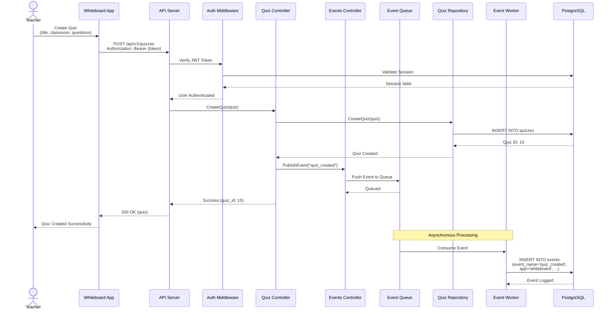
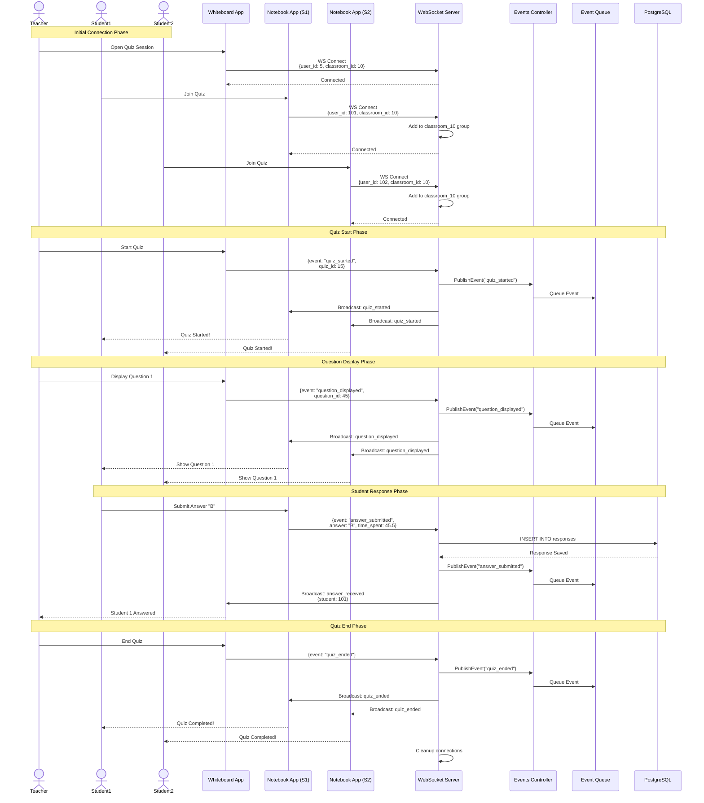
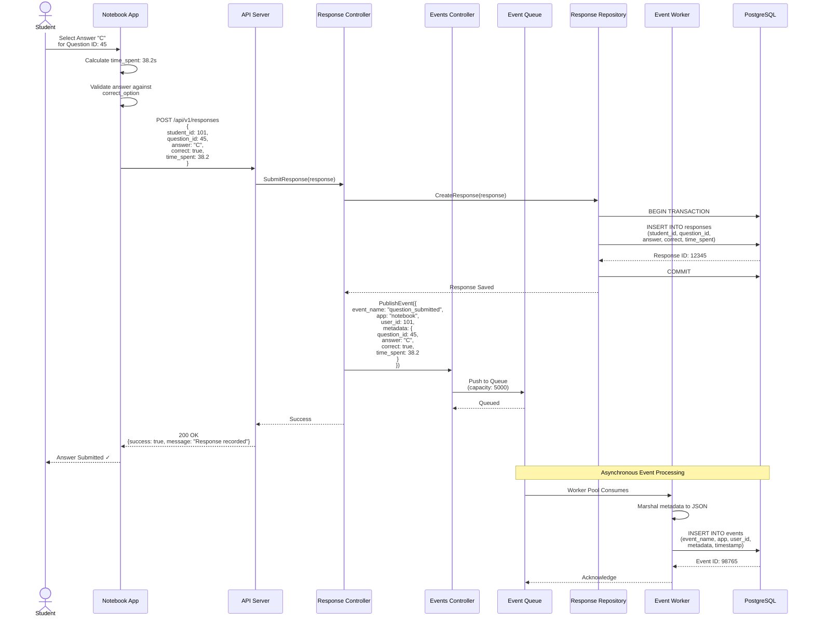
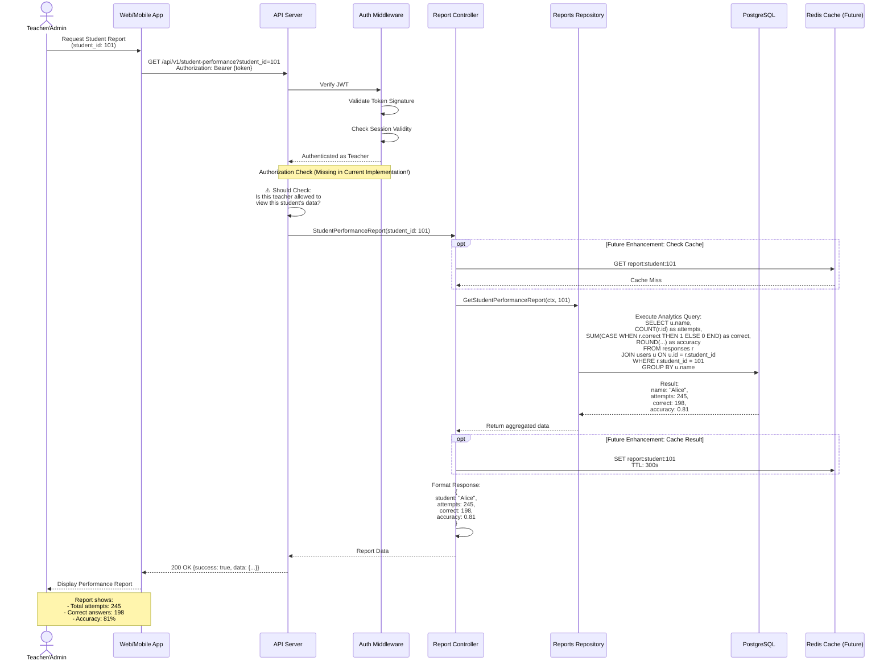
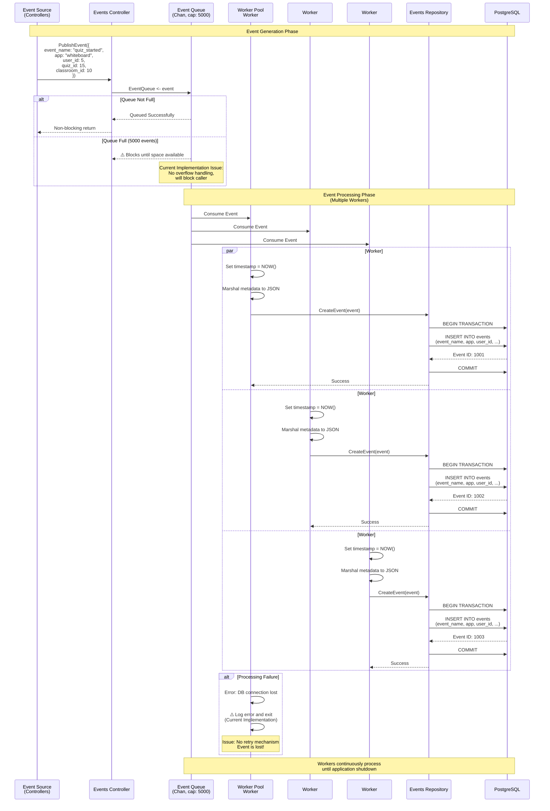
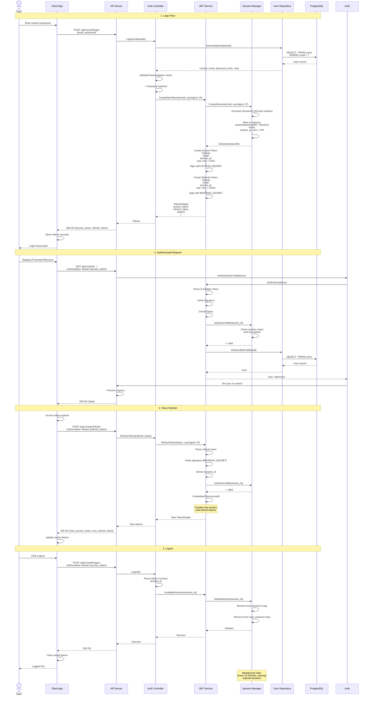

# Sequence Diagrams - EduAnalytics Reporting Framework

## Table of Contents
1. [Quiz Creation Flow](#1-quiz-creation-flow)
2. [Real-time Quiz Session (WebSocket)](#2-real-time-quiz-session-websocket)
3. [Student Response Submission](#3-student-response-submission)
4. [Report Generation Flow](#4-report-generation-flow)
5. [Event Processing Pipeline](#5-event-processing-pipeline)
6. [User Authentication Flow](#6-user-authentication-flow)

---

## 1. Quiz Creation Flow

**Description:** Teacher creates a quiz from the Whiteboard app, which is stored in the database and tracked as an event.

**Key Points:**
- Synchronous: Quiz creation (fast response to user)
- Asynchronous: Event logging (doesn't block user)
- Authentication required before any operation
- Event queue decouples business logic from analytics

---

## 2. Real-time Quiz Session (WebSocket)

**Description:** Teacher starts a quiz and displays questions in real-time. Students connect via WebSocket and receive updates.

**Key Points:**
- Persistent WebSocket connections for low-latency
- Classroom-based broadcasting (all students in classroom receive updates)
- Teacher controls flow (starts quiz, displays questions, ends quiz)
- Students can submit answers independently
- All events logged asynchronously for analytics
- Responses saved synchronously (important for real-time feedback)

---

## 3. Student Response Submission

**Description:** Alternative flow for students submitting answers via REST API (non-WebSocket).

**Key Points:**
- REST API as alternative to WebSocket
- Answer validation happens client-side (app knows correct answer)
- Response saved synchronously (critical for consistency)
- Event logged asynchronously (for analytics, not critical path)
- Transaction ensures data integrity
- Event worker pool processes events in background

---

## 4. Report Generation Flow

**Description:** Teacher or admin requests a student performance report.

**Key Points:**
- Authentication required (JWT)
- **Missing:** Authorization check (should verify teacher can access this student)
- Direct database query (no caching in current implementation)
- Single aggregation query for efficiency
- Future enhancement: Redis caching (5-minute TTL)
- Report is read-only (no data modification)

---

## 5. Event Processing Pipeline

**Description:** Detailed view of how events flow from generation to storage.

**Key Points:**
- **Asynchronous Processing:** Events don't block API responses
- **Worker Pool:** Configurable concurrency (default: set on startup)
- **Buffered Channel:** 5,000 event capacity
- **Current Issues:**
  - No persistent queue (events lost on crash)
  - No retry mechanism for failed events
  - No dead-letter queue
  - Workers exit on error instead of retrying
- **Recommended Improvements:**
  - Use RabbitMQ/Kafka for persistence
  - Implement exponential backoff retry
  - Add dead-letter queue for failed events
  - Add circuit breaker for DB failures

---

## 6. User Authentication Flow

**Description:** Complete authentication lifecycle from login to logout.

**Key Points:**
- **Dual-Token System:**
  - Access Token: Short-lived (5 min), used for API requests
  - Refresh Token: Longer-lived (10 min), used to get new access tokens
- **Session Management:**
  - In-memory storage (⚠️ not production-ready)
  - 24-hour session expiry
  - Session ID embedded in JWT claims
- **Security:**
  - Passwords hashed with bcrypt
  - JWT signed with HMAC-SHA256
  - Separate secrets for access and refresh tokens
  - Session validation on every request
- **Current Issues:**
  - Sessions lost on server restart
  - Cannot scale horizontally (in-memory)
  - Refresh token expiry (10 min) is too short
- **Recommended Improvements:**
  - Use Redis for session storage
  - Increase refresh token lifetime to 7-30 days
  - Add refresh token rotation
  - Implement token revocation list

---

## Summary of Flows

| Flow | Sync/Async | Critical Path | Auth Required | Key Tables |
|------|------------|---------------|---------------|------------|
| Quiz Creation | Sync + Async Event | Yes | ✅ | quizzes, events |
| WebSocket Quiz Session | Real-time | Yes | ⚠️ Missing | responses, events |
| Response Submission | Sync + Async Event | Yes | ⚠️ Missing | responses, events |
| Report Generation | Sync | No (read-only) | ⚠️ Missing | responses, users, classrooms |
| Event Processing | Async | No (analytics) | N/A | events |
| Authentication | Sync | Yes | Public endpoints | users, sessions (in-memory) |

---

## Viewing These Diagrams

**Option 1: Mermaid Live Editor**
1. Copy any diagram code block
2. Paste into https://mermaid.live/

**Option 2: VS Code**
1. Install "Markdown Preview Mermaid Support" extension
2. Open this file and preview (Ctrl+Shift+V)

**Option 3: GitHub**
- GitHub natively renders Mermaid diagrams in markdown

**Option 4: Export as PNG/SVG**
- Use mermaid.live to export as image
- Or use mermaid-cli: `mmdc -i diagram.mmd -o diagram.png`

---

**Last Updated:** October 7, 2025  
**Version:** 1.0  
**Diagrams:** 6 key workflows

